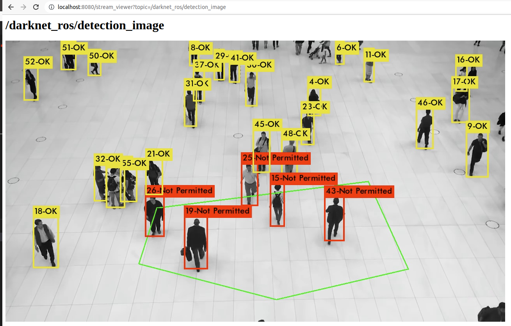

# Restricted Area Tracking:  Pedestrian moving into restricted area Real-Time Object Tracing based on ROS 1

## Overview

Real-time tracking pedestrians who move into Restricted Area (Green Polygon)

- Yellow Label: Tracking ID, the pedestrian is moving outside of restricted area
- Red Label: Tracking ID, the pedestrian is moving inside of restricted area

**Author: [Nguyen Duc Thinh (Leona)](https://www.linkedin.com/in/nguyenducthinhdl/), nguyenducthinhdl@gmail.com**

I used only person class for pedestrian detection.

## Installation

### Dependencies

This software is built on the Robotic Operating System ([ROS]), which needs to be [installed](http://wiki.ros.org) first. Additionally, YOLO for ROS depends on following software:

- [OpenCV](http://opencv.org/) (computer vision library),
- [boost](http://www.boost.org/) (c++ library),

### Building with Docker

Avoid incompatibility issues with this dockerfile that will work out of the box. Docker image includes ubuntu 18.04, ROS melodic, CUDA 11.7. Docker image will install darknet_ros and the usb_cam package.

Install docker here: <https://docs.docker.com/engine/installation/linux/docker-ce/ubuntu/>

Install nvidia-docker here: <https://github.com/NVIDIA/nvidia-docker>

Build docker image with default mode and data:

`docker build -t ros-yolo3-restricted-area .`

`./script/test_script.bash`

- Wait several minutes for starting ros applications, building
- You can try log to runtime container to view logs:
  - Get container id: `docker ps | grep ros-yolo3-restricted-area`
  - View logs `docker <container-id>`

Build docker image with bash node:

`docker build -t ros-yolo3-restricted-area .`
`./script/bash_script.bash`
`/script/test_script.bash` (inside the docker container)

#### Note

Darknet on the CPU is fast (approximately 1.5 seconds on an Intel Core i7-6700HQ CPU @ 2.60GHz × 8) but it's like 500 times faster on GPU! You'll have to have an Nvidia GPU and you'll have to install CUDA. The CMakeLists.txt file automatically detects if you have CUDA installed or not. CUDA is a parallel computing platform and application programming interface (API) model created by Nvidia. If you do not have CUDA on your System the build process will switch to the CPU version of YOLO. If you are compiling with CUDA, you might receive the following build error:

    nvcc fatal : Unsupported gpu architecture 'compute_61'.

This means that you need to check the compute capability (version) of your GPU. You can find a list of supported GPUs in CUDA here: [CUDA - WIKIPEDIA](https://en.wikipedia.org/wiki/CUDA#Supported_GPUs). Simply find the compute capability of your GPU and add it into /catkin_workspace/src/darknet_ros/darknet_ros/CMakeLists.txt. Simply add a similar line like

    -O3 -gencode arch=compute_62,code=sm_62

### Result

I tried only on local machine:

- Intel(R) Core(TM) i7-7700HQ CPU @ 2.80GHz
- GP107M [GeForce GTX 1050 Mobile] 2GB VRAM

The performance result:

- CPU (Without Cuda): 0.8 FPS
- GPU mode: 12-20 FPS (Need to optimize by gpu architecture)